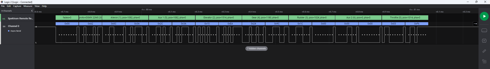

# Spektrum (tm) Remote Receiver Packet Analyzer

This analyzer allows you to inspect the contents of packets received by Spektrum Remote Receivers over UART.

## Setup

0. Install this Analyzer/Extension
1. Connect Spektrum Receivers TX pin to a channel on the Saleae Logic Analyzer
2. Attach a Async Serial Analyzer to the channel in the Logic Software, 115200 bps, 8N1
3. Add the Spektrum Remote Receiver Analyzer (use the Async Serial Analyzer as input)
4. Configure Analyzer settings
5. PROFIT! Happy analyzing

## Further Information

For more info on the protocol used etc. check the [official datasheet (PDF)](https://www.spektrumrc.com/ProdInfo/Files/Remote%20Receiver%20Interfacing%20Rev%20A.pdf)

_Pull requests welcome :-)_
  
