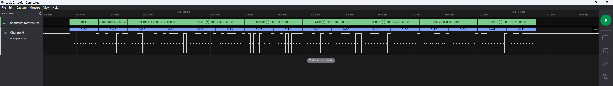

# Spektrum™ DSMX Receiver Packet Analyzer

This project provides a high-level analyzer for decoding packets received by Spektrum™ DSMX Remote Receivers over UART. It is designed to work with the Saleae Logic Analyzer software.

---

## Features

- Decodes Spektrum™ Remote Receiver packets.
- Supports multiple protocols: DSM2 and DSMX.
- Displays fades, system type, and channel data.

---

## Setup Instructions

Follow these steps to set up and use the analyzer:

1. **Install the Analyzer/Extension**  
   Add this extension to your Saleae Logic Analyzer software.

2. **Connect the Receiver**  
   Connect the TX data pin of your Spektrum™ Receiver to a channel on the Saleae Logic Analyzer.

3. **Configure the Async Serial Analyzer**  
   - Attach an Async Serial Analyzer to the channel in the Saleae Logic software.
   - Use the following settings:
     - Baud Rate: `115200 bps`
     - Data Bits: `8`
     - Parity: `None`
     - Stop Bits: `1`

4. **Add the Spektrum™ Remote Receiver Analyzer**  
   Use the Async Serial Analyzer as the input for this analyzer.

5. **Configure the Analyzer Settings**  
   - Select the receiver type (`INTERNAL` or `EXTERNAL`).
   - Choose the protocol (`DSM2` or `DSMX`).

6. **_PROFIT! :-)_**  
   You should now be able to see captured packets

---

## Supported Protocols

The analyzer supports the following Spektrum™ protocols:

- **DSM2 22MS 1024**
- **DSM2 11MS 2048**
- **DSMX 22MS 2048**
- **DSMX 11MS 2048**

---

## Output Details

The analyzer provides the following information for each packet:

- **Fades**: Number of fades detected.
- **System Type**: Protocol type and whether it matches the configured setting.
- **Channel Data**: Channel name, ID, position, and phase (if applicable).
- **Errors**: Frames with errors are flagged for easy identification.

---

## Further Information

For more details about the Spektrum™ protocol, refer to the [official datasheet (PDF)](https://www.spektrumrc.com/ProdInfo/Files/Remote%20Receiver%20Interfacing%20Rev%20A.pdf).

---

## Contributing

_Contributions are welcome! :-)_

Feel free to submit a pull request to improve the analyzer or its documentation. 

---

## License

This project is released under the [Unlicense](LICENSE), making it free and open-source.

---